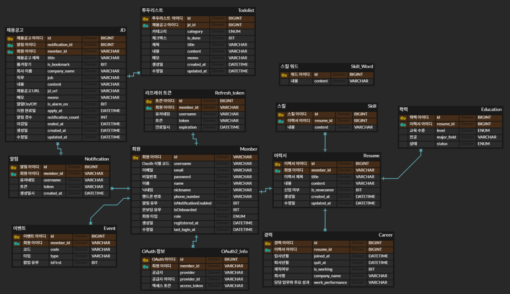
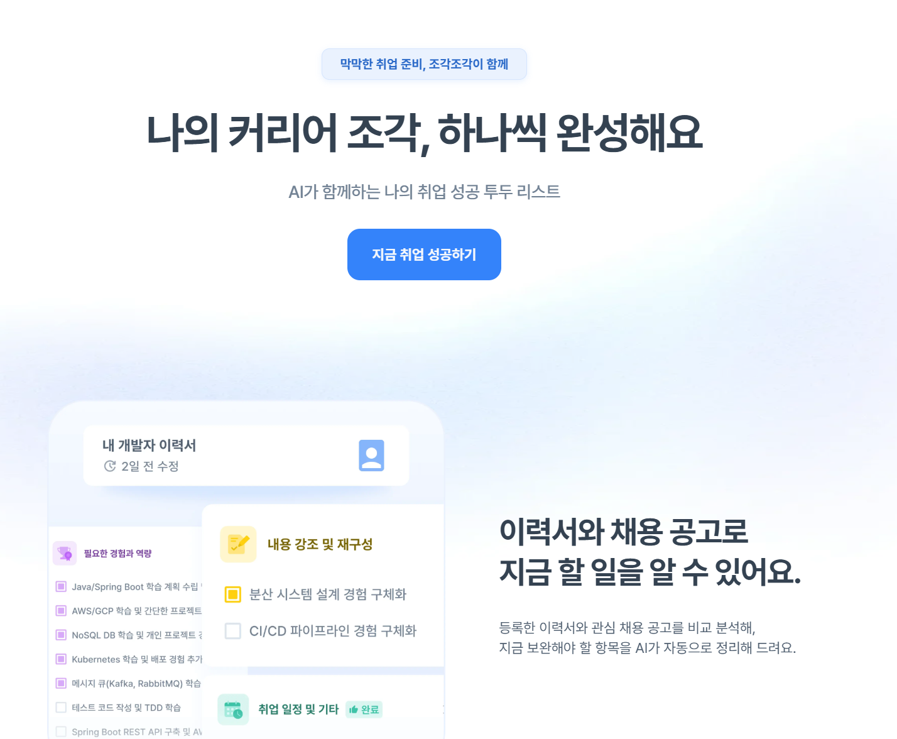
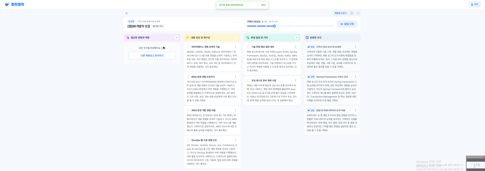
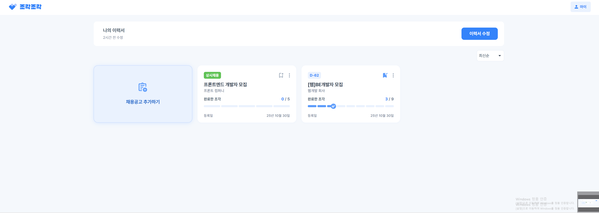
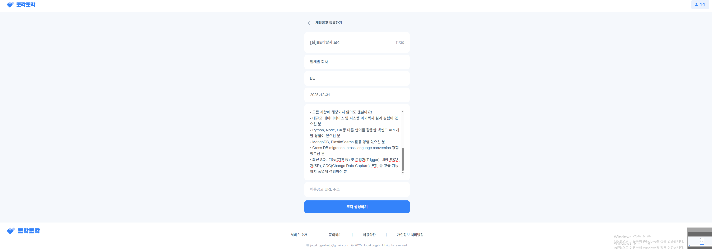
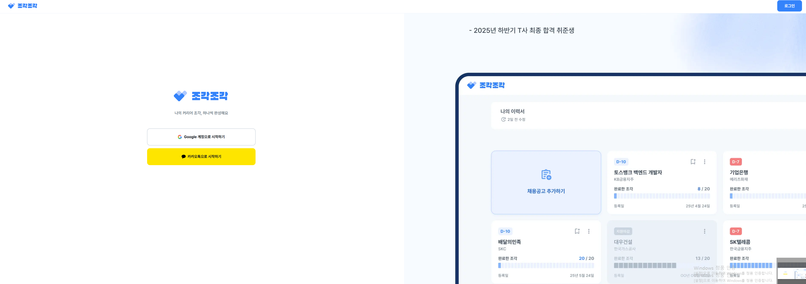
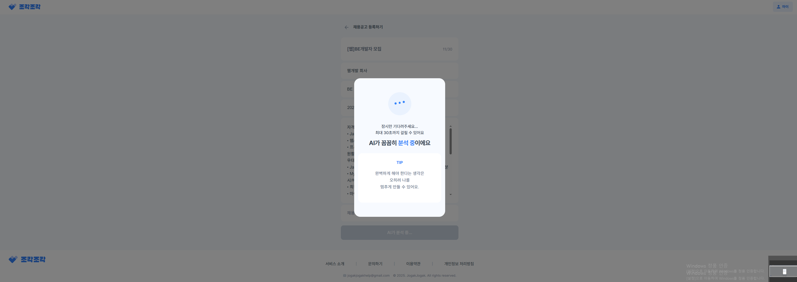
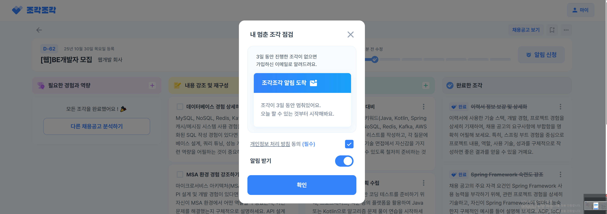

# 조각조각                        
## 프로젝트 목표
Gemini 2.0 모델을 사용하여 이력서, JD를 분석 후 부족한 부분을 체크리스트 형식으로 제공하여 취업에 도움 되는 내용을 알려주는 서비스입니다.

**프로젝트 기간:** 2025.06 ~ 2025.10

**참여 인원:** PM 2명, 디자이너 2명, FE 2명, BE 3명

## 기술 스택

**Backend**
- Java Spring Boot, Spring JPA, Spring Security, Spring Batch
- JWT, OAuth 2.0, QueryDSL
- Java Mail Sender, Swagger

**Database**
- MySQL, Redis, RDS

**Infrastructure**
- Docker, EC2, Route 53, S3

## 아키텍처 설계
- Java Spring Boot로 백엔드 구현
- Spring Security 프레임워크 기반으로 구현하며 카카오, 구글 소셜 로그인 연동을 위해 OAuth 2.0을 사용
- RESTful API로 설계
- DB는 오픈소스이면서 빠르고 범용성이 좋은 MySQL을 사용
- Spring Batch로 이메일 알림 서비스를 구현
- Google Analytics로 사용자 패턴을 기록
- AI는 Gemini 2.0 Flash 모델을 사용
- CI/CD 파이프라인은 Docker, GitHub Actions, EC2로 구축
- 도메인 주소, HTTPS, RDS 등 배포에 필요한 서비스는 AWS를 이용

## ERD

## 화면 구성

## 프로젝트 기능 및 설계

### 담당 기능

- 로그인 / 회원가입
    - OAuth 2.0을 이용하여 구글, 카카오 소셜 로그인 시 회원가입이 함께 진행된다.
    - Access Token은 30분, Refresh Token은 7일 후 만료되고 Access Token 만료 시 Refresh Token으로 재발급한다.
    - Refresh Token을 HttpOnly 쿠키에 저장하여 XSS 공격으로 인한 토큰 탈취를 방지한다.
    - Spring Security Stateless 세션 정책을 적용하여 서버 측 세션을 사용하지 않는다.
    - 회원탈퇴 시 Kakao Admin Key 방식, Google Token Revoke 방식으로 토큰 만료와 무관하게 OAuth 연동을 즉시 해제한다.

- 이메일 알림 배치
    - 알림 설정이 활성화된 사용자 중 채용공고 To do list를 3일 이상 갱신하지 않은 경우 독려 이메일을 발송한다.
    - 동일 채용공고에 대한 알림은 최대 3회로 제한하고, 마감된 채용공고는 발송 대상에서 자동 제외한다.
    - Spring Batch 스케줄러를 통해 매일 오전 10시에 일괄 발송한다.
    - Spring Batch Two-Step 구조로 구성하여 1단계에서 알림 대상 JD 처리, 2단계에서 이메일 발송을 분리한다.
    - 이메일 템플릿에 사용되는 로고, 아이콘 등 정적 이미지는 AWS S3에 업로드된 리소스를 참조한다.

### 성능 개선 및 기술 선택 근거

**Spring Batch 이메일 알림 배치 최적화**
- **처리 성능**: Reader/Writer 조합을 JpaPagingItemReader + JpaItemWriter에서 JdbcCursorItemReader + JdbcBatchItemWriter로 변경해 10만 건 기준 2m 53s → 22s, 50만 건 기준 41m 5s → 1m 50s로 단축했습니다.
- **Reader 선택 근거**: JpaPaging은 페이지마다 OFFSET 쿼리를 재실행해 데이터가 많을수록 비용이 급증하는 반면 JdbcCursor는 최초 쿼리 실행 후 커서를 고정해 순차 스캔하므로 OFFSET 비용이 없고 fetchSize 설정으로 서버 메모리 부담 없이 스트리밍 처리했습니다. JPQL 대신 SQL을 직접 작성해 ORM 추상화 대신 컬럼명과 조인 조건을 직접 관리하는 방식을 선택했습니다.
- **Writer 선택 근거**: JpaItemWriter는 청크 내 아이템마다 em.merge()를 호출하고 청크 끝에 flush하는 반면 JdbcBatchItemWriter는 executeBatch()로 청크 전체를 단일 네트워크 요청으로 처리하고 rewriteBatchedStatements=true 옵션으로 DB 왕복 횟수를 최소화했습니다. 영속성 컨텍스트 없이 동작해 1차 캐시, 더티체킹, 지연 로딩 등 JPA 기능 대신 직접 제어하는 방식으로 구현했습니다.

**Spring Batch Two-Step 구조 선택**
- Step1(알림 대상 JD 조회 → Notification 저장)과 Step2(이메일 발송 → 상태 업데이트)를 분리해 Step1 실패 시 Step2가 실행되지 않도록 제어했습니다. 발송 실패 건만 재시도(3회)하거나 Skip(최대 50건)하며 DEAD_LETTER 상태로 관리하고 PENDING 레코드를 주기적으로 정리하는 정책도 함께 구현했습니다.

**JpaPagingItemReader OFFSET 문제 — 데이터 누락**
- **문제**: Step2에서 PENDING 상태의 Notification을 JpaPagingItemReader로 읽으며 발송 후 SENT로 업데이트하면 다음 페이지 OFFSET이 밀려 일부 데이터가 누락됐습니다.
- **원인**: 청크 처리 후 상태가 PENDING → SENT로 바뀌며 결과셋 크기가 줄어들어 OFFSET 계산이 어긋났습니다.
- **해결**: JdbcCursorItemReader로 교체해 최초 쿼리 실행 시 커서를 고정하고 이후 상태 변경과 무관하게 순차적으로 읽도록 변경했습니다.

**Spring Batch 메타 DB 분리**
- 배치 메타테이블을 전용 RDS 인스턴스로 분리해 배치 I/O 부하가 서비스 DB 쿼리에 미치는 영향을 차단했습니다. 메타 DB 장애가 발생해도 서비스 DB는 정상 운영되도록 DataSource와 TransactionManager와 EntityManagerFactory를 각각 별도 Bean으로 구성해 인프라를 분리했습니다.

**이력서 중복 등록 방지**
- **문제**: 회원당 이력서 1개 제한을 애플리케이션 레이어에서만 검증하면 동시 요청 시 두 요청 모두 이력서 없음을 확인한 후 각각 저장해 중복 등록되는 문제가 있었습니다.
- **해결**: resume.member_id 컬럼에 DB UNIQUE 제약을 추가해 애플리케이션 검증과 DB 레벨 이중 방어를 구성했습니다. 동시 요청 환경에서도 데이터 정합성을 보장했습니다.

**Redis 기반 인증 보안 강화**
- **RefreshToken 저장소 (RDB → Redis)**: RDB는 토큰 재발급마다 DB I/O가 발생하는 반면 Redis는 인메모리 구조로 빠르게 조회하고 TTL로 만료 토큰을 자동 삭제하도록 구현했습니다. refresh:{userId} 키 구조로 사용자당 하나의 토큰만 유지해 재발급 시 저장된 값과 불일치하면 탈취로 판단해 즉시 삭제하도록 구성했습니다.
- **AccessToken 블랙리스트**: JWT는 stateless 특성상 발급 후 서버에서 무효화할 수 없어 로그아웃 시 AccessToken의 JTI(JWT ID)를 Redis에 저장하고 요청마다 블랙리스트를 확인해 즉시 무효화하도록 구현했습니다. TTL을 AccessToken 잔여 만료 시간으로 설정해 불필요한 키가 자동 삭제되도록 구성했습니다.

### 팀원 구현 기능

- 이력서
    - 로그인한 사용자는 제목, 내용을 입력하여 이력서를 등록할 수 있다.
    - 이력서 내용은 5000자 이하여야 한다.
    - 로그인한 사용자는 하나의 이력서만 등록할 수 있다.
    - 로그인한 사용자는 이력서 수정, 조회, 삭제가 가능하다.

- 채용공고
    - 로그인한 사용자는 이력서 등록 후 채용공고의 제목, URL, 회사명, 직무, 내용, 마감일을 입력하여 이력서와 채용공고를 비교한 보완 todolist를 분석받을 수 있다.
    - 채용공고 내용은 최소 300자 이상이어야 한다.
    - 로그인한 사용자는 특정 채용공고 분석 내용 조회, 전체 리스트 조회, 즐겨찾기 등록, 지원 완료, 메모 수정을 할 수 있다.
    - 채용공고 분석은 최대 20개까지 가능하다.

- To do list
    - 채용공고 분석 시 Gemini 2.0을 이용하여 분석하고 해요체로 todolist를 작성한다.
    - todolist 타입은 구조적 보완 계획, 내용 강조 및 재구성 제안, 일정 관리 및 기타 3가지로 분류된다.
    - 각 타입별 todolist는 10개를 초과할 수 없다.
    - 로그인한 사용자는 todolist를 추가, 수정, 삭제할 수 있다.

