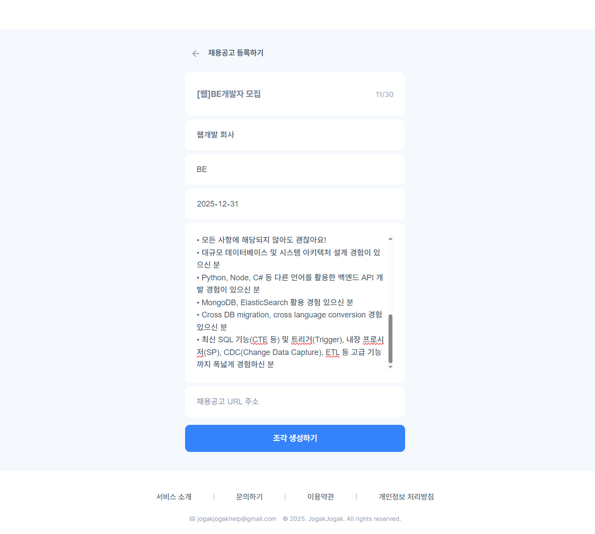
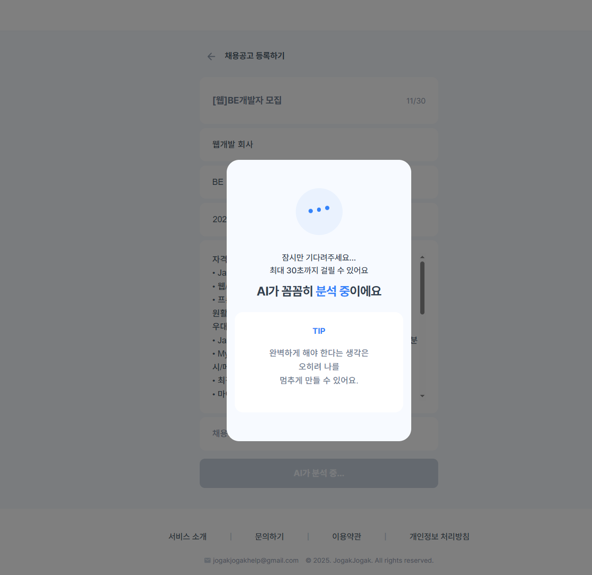
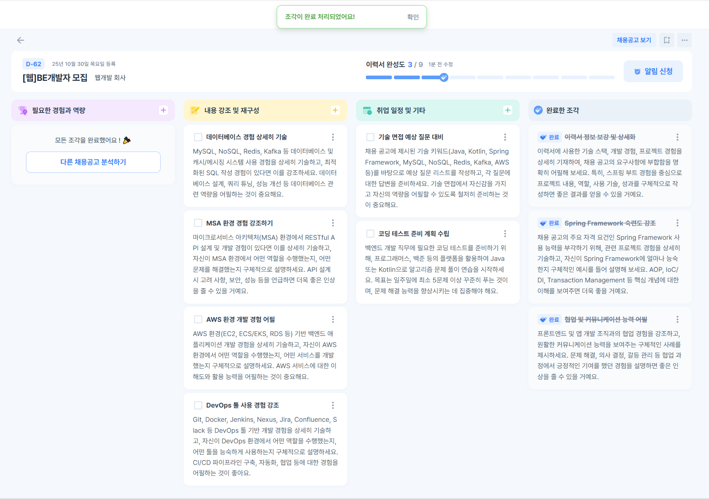
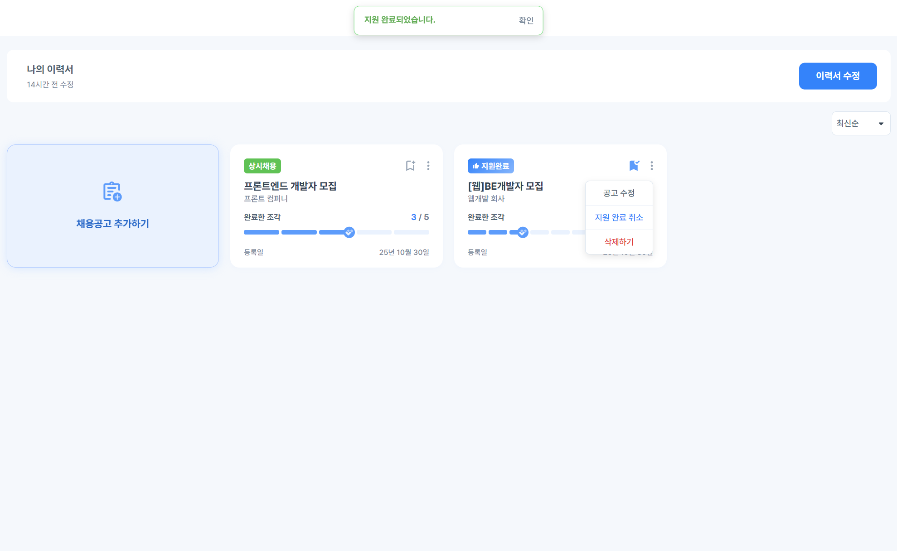
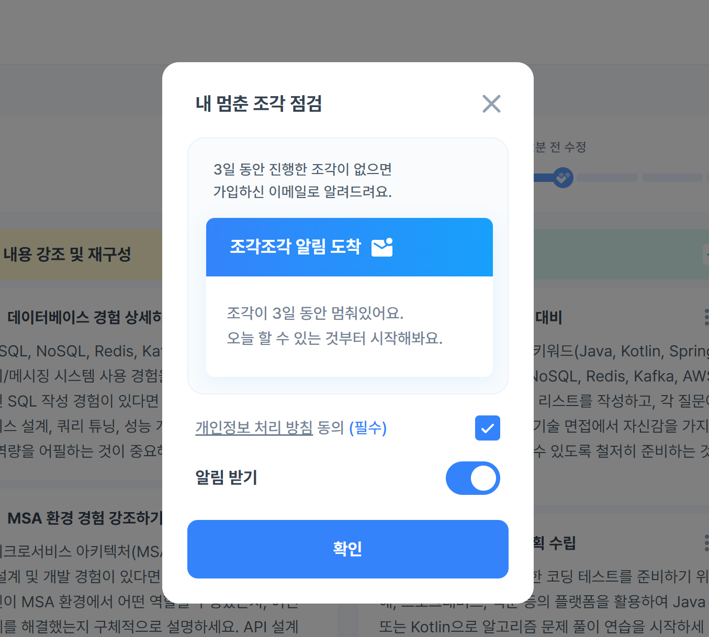
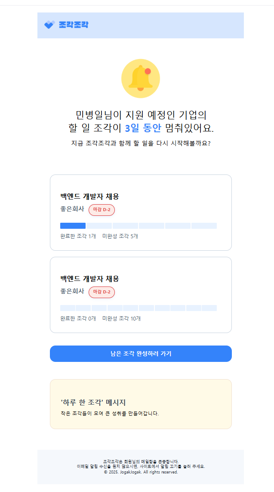

## 프로젝트 목표
Gemini 2.0 모델을 사용하여 이력서, JD를 분석 후 부족한 부분을 체크리스트 형식으로 제공하여 취업에 도움 되는 내용을 알려주는 서비스입니다.

**프로젝트 기간:** 2025.06 ~ 2025.10

**참여 인원:** PM 2명, 디자이너 2명, FE 2명, BE 3명

## 기술 스택

**Backend**
- Java Spring Boot, Spring JPA, Spring Security, Spring Batch
- JWT, OAuth 2.0, QueryDSL
- Java Mail Sender, Swagger

**Database**
- MySQL, Redis, RDS

**Infrastructure**
- Docker, EC2, Route 53, S3

## 아키텍처 설계
- Java Spring Boot로 백엔드 구현
- Spring Security 프레임워크 기반으로 구현하며 카카오, 구글 소셜 로그인 연동을 위해 OAuth 2.0을 사용
- RESTful API로 설계
- DB는 오픈소스이면서 빠르고 범용성이 좋은 MySQL을 사용
- Spring Batch로 이메일 알림 서비스를 구현
- Google Analytics로 사용자 패턴을 기록
- AI는 Gemini 2.0 Flash 모델을 사용
- CI/CD 파이프라인은 Docker, GitHub Actions, EC2로 구축
- 도메인 주소, HTTPS, RDS 등 배포에 필요한 서비스는 AWS를 이용

## ERD

## 화면 구성

## 프로젝트 기능 및 설계

### 담당 기능

- **로그인 / 회원가입**
    - OAuth 2.0을 이용하여 구글, 카카오 소셜 로그인 시 회원가입이 함께 진행된다.
    - Access Token은 30분, Refresh Token은 7일 후 만료되고 Access Token 만료 시 Refresh Token으로 재발급한다.
    - Refresh Token을 HttpOnly 쿠키에 저장하여 XSS 공격으로 인한 토큰 탈취를 방지한다.
    - Spring Security Stateless 세션 정책을 적용하여 서버 측 세션을 사용하지 않는다.
    - 회원탈퇴 시 Kakao Admin Key 방식, Google Token Revoke 방식으로 토큰 만료와 무관하게 OAuth 연동을 즉시 해제한다.

- **이메일 알림 배치**
    - 알림 설정이 활성화된 사용자 중 채용공고 To do list를 3일 이상 갱신하지 않은 경우 독려 이메일을 발송한다.
    - 동일 채용공고에 대한 알림은 최대 3회로 제한하고, 마감된 채용공고는 발송 대상에서 자동 제외한다.
    - Spring Batch 스케줄러를 통해 매일 오전 10시에 일괄 발송한다.
    - Spring Batch Two-Step 구조로 구성하여 1단계에서 알림 대상 JD 처리, 2단계에서 이메일 발송을 분리한다.
    - 이메일 템플릿에 사용되는 로고, 아이콘 등 정적 이미지는 AWS S3에 업로드된 리소스를 참조한다.

### 팀원 구현 기능

- 이력서
    - 로그인한 사용자는 제목, 내용을 입력하여 이력서를 등록할 수 있다.
    - 이력서 내용은 5000자 이하여야 한다.
    - 로그인한 사용자는 하나의 이력서만 등록할 수 있다.
    - 로그인한 사용자는 이력서 수정, 조회, 삭제가 가능하다.

- 채용공고
    - 로그인한 사용자는 이력서 등록 후 채용공고의 제목, URL, 회사명, 직무, 내용, 마감일을 입력하여 이력서와 채용공고를 비교한 보완 todolist를 분석받을 수 있다.
    - 채용공고 내용은 최소 300자 이상이어야 한다.
    - 로그인한 사용자는 특정 채용공고 분석 내용 조회, 전체 리스트 조회, 즐겨찾기 등록, 지원 완료, 메모 수정을 할 수 있다.
    - 채용공고 분석은 최대 20개까지 가능하다.

- To do list
    - 채용공고 분석 시 Gemini 2.0을 이용하여 분석하고 해요체로 todolist를 작성한다.
    - todolist 타입은 구조적 보완 계획, 내용 강조 및 재구성 제안, 일정 관리 및 기타 3가지로 분류된다.
    - 각 타입별 todolist는 10개를 초과할 수 없다.
    - 로그인한 사용자는 todolist를 추가, 수정, 삭제할 수 있다.

